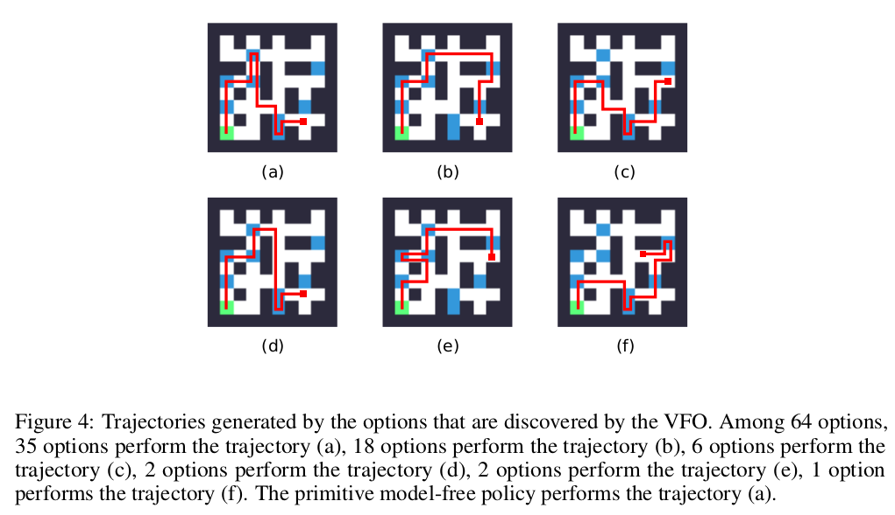

# VFO

## Introduction

Visual Feature Options (VFO) is an algorithm for option discovery proposed in
my work "Option Discovery from Visual Features in Deep Reinforcement Learning"
at [Deep RL Workshop](https://sites.google.com/view/deep-rl-workshop-nips-2018/home)
at NeurIPS 2018. Comparing to other option discovery methods that are also based
on representation features, VFO can find more task-specific options with less
computation cost. It also shows the potential to get multiple optimal solutions
in some RL tasks. For example, in the 2D maze environment, with 84x84 RGB image
as observation, the green agent aims to "eat" blue goals while avoid hitting
black walls. VFO can find multiple optimal paths to "eat" blue goals as much as
possible within 20 steps.

## Architecture

The code in **baselines/vfo** folder implements following architecture.

## Acknowledgement

This repo is devloped on top of [OpenAI baselines](https://github.com/openai/baselines).
